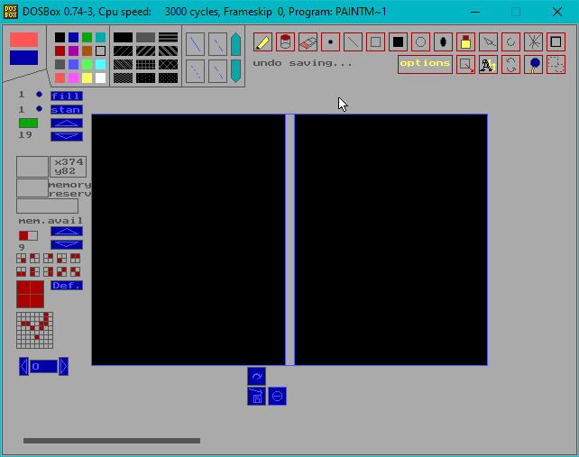

# pascal
My first projects made in pascal (borland/turbo/delphi)

<!--TOC-->
  - [GGAME](#ggame)
    - [Details](#details)
    - [Instructions](#instructions)
    - [Screenshots](#screenshots)
  - [FIRE](#fire)
    - [Details](#details)
    - [Instructions](#instructions)
    - [Screenshots](#screenshots)
  - [STRIKE](#strike)
    - [Details](#details)
    - [Instructions](#instructions)
    - [Screenshots](#screenshots)
  - [Seawar](#seawar)
    - [Details](#details)
    - [Instructions](#instructions)
    - [Screenshots](#screenshots)
  - [Memview](#memview)
    - [Details](#details)
    - [Instructions](#instructions)
    - [Screenshots](#screenshots)
  - [Paintman2](#paintman2)
    - [Details](#details)
    - [Instructions](#instructions)
    - [Screenshots](#screenshots)
  - [Paintman3](#paintman3)
    - [Details](#details)
    - [Instructions](#instructions)
    - [Screenshots](#screenshots)
  - [Quad](#quad)
    - [Details](#details)
    - [Instructions](#instructions)
    - [Screenshots](#screenshots)
<!--/TOC-->

## GGAME

One of my first feature complete games created.

### Details

**Created**: 2000 (2004) released

**Language**: Pascal

**Features**:
- 16 colors
- 640x480 screen resolution
- save and loading
- sound effects via PC speaker!
- all the graphics made by yours truly.

**Source code**: [ggame](/ggame/code)

**Executable (DOS)**: [ggame.exe](/ggame/release/GGAME.EXE)

### Instructions

**Installation**: [Run it via DosBox](https://www.dosbox.com/)

**Controls**:

- [Left] and [Right] to change angle of attack
- [Up] and [Down] To change thrust of explosion
- [s] or [n] to change current weapon (note) if you doesn't have this weapon installed then shot wouldn't do 
any damage.

### Screenshots

## FIRE

Another game where the goal is to catch people that are jumping from the roof of the building.

### Details

**Created**: 2000

**Language**: Pascal

**Features**:
- 16 colors
- 640x480 screen resolution
- animations
- all the graphics made by yours truly.

**Source code**: [fire](/fire/code)

**Executable (DOS)**: [FIRE.EXE](/fire/release/FIRE.EXE)

### Instructions

**Installation**: [Run it via DosBox](https://www.dosbox.com/)

**Controls**:

- [Left] and [Right] to move the platform

### Screenshots

## STRIKE

A very simple pong game, ither one or two players.

### Details

**Created**: 2000

**Language**: Pascal

**Features**:
- 16 colors
- 640x480 screen resolution
- color graphics
- all the graphics made by yours truly.

**Source code**: [strike](/strike/code)

**Executable (DOS)**: [STRIKE.EXE](/strike/release/STRIKE.EXE)

### Instructions

**Installation**: [Run it via DosBox](https://www.dosbox.com/)

**Controls**:

- [Left] and [Right] to move the platform

### Screenshots

## Seawar

A game based on a common sea war game.

### Details

**Created**: 2000

**Language**: Pascal

**Features**:
- 16 colors
- 640x480 screen resolution
- ship position validation

**Source code**: [seawar](/seawar/code)

**Executable (DOS)**: [ggame.exe](/seawar/release/seawar.exe)

### Instructions

**Installation**: [Run it via DosBox](https://www.dosbox.com/)

**Controls**:

- [Left] and [Right] to move the ship left or right
- [Up] and [Down] To move the ship up and down
- [s] to rate a ship

### Screenshots

## Memview

Memory viewer for available memory range

### Details

**Created**: 2000

**Language**: Pascal

**Features**:
- 320x240

**Source code**: [memview](/memview/code)

**Executable (DOS)**: [MEMVIEW1.EXE](/memview/release/MEMVIEW1.EXE)

### Instructions

**Installation**: [Run it via DosBox](https://www.dosbox.com/)

**Controls**:

- [Up] and [Down] To move one line up or down
- [PageUp] and [PageDown] To move entire frame

### Screenshots

## Paintman2

Custom made application to draw shapes via vector graphics

### Details

**Created**: 2001

**Language**: Pascal

**Features**:
- 640x480
- 16 colors
- Vector graphics, different shapes line styles and fill patterns
- Saving and loading of files

**Source code**: [paintman2](/paintman2/code)

**Executable (DOS)**: [PAINTMAN2.EXE](/paintman2/release/PAINTMAN2.EXE)

### Instructions

**Installation**: [Run it via DosBox](https://www.dosbox.com/)

**Controls**:

- On loading, define a name of the file to save to
- Use mouse to select shapes/color/fill type on the top ribbon panel
- Use (blue/red) buttons to save or load a file

### Screenshots

## Paintman3

Second iteration much more feature rich graphical image editor.

### Details

**Created**: 2001

**Language**: Pascal

**Features**:
- 640x480
- 16 colors
- Base color or fill color
- Loading and saving images
- Different shapes
- Options and settings
- Undo or redo

**Source code**: [paintman3](/paintman3/code)

**Executable (DOS)**: [Paintman3.EXE](/paintman3/release/Paintman3.EXE)

### Instructions

**Installation**: [Run it via DosBox](https://www.dosbox.com/)

**Controls**:

- Use mouse to select shapes/color/fill type on the top ribbon panel
- Use (blue/red) buttons to save or load a file

### Screenshots

## Quad

[Quadratic function calculator](https://en.wikipedia.org/wiki/Quadratic_function)

### Details

**Created**: 2000

**Language**: Pascal

**Features**:
- Text based
- Correctness validations

**Source code**: [quad](/quad/code)

**Executable (DOS)**: [quad.exe](/quad/release/QUAD.EXE)

### Instructions

**Installation**: [Run it via DosBox](https://www.dosbox.com/)

### Screenshots

